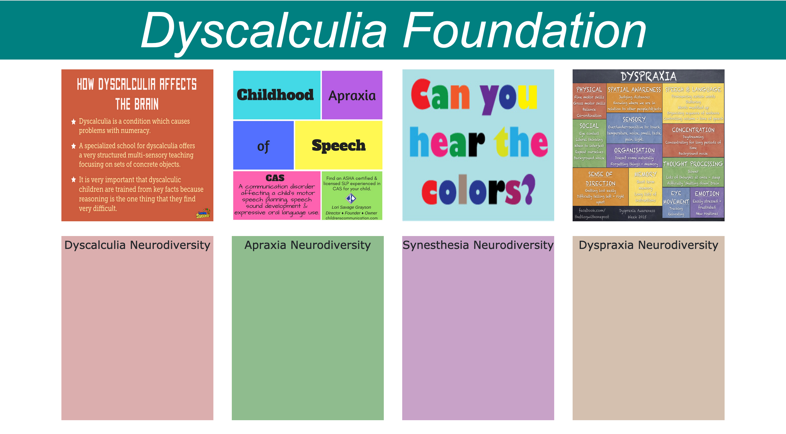

# Dyscalculia Foundation

This is a personal project that I am currently working on. My overarching goal is to raise awareness of Neurodiversity generally, and Dyscalculia specifically, in New Zealand.

* MVP (Minimum Viable Project)

Dyscalculia Foundation will display boxes of information about Dyscalculia which will be displayed in a way which is easy to view and navigate for people with Neurodiversities. 

The user will be able to see images (in boxes as well) next to the text about Dyscalculia. There will also be an option for users to create an account. 

On the ‘create an account’ section the user will be able to sign up, sign in and sign out, with an option to delete their account. 

As MVP I will have text that describes selected Neurodiversities, along with images that represent them, i.e., Dyscalculia, Apraxia, Synesthesia and Dyspraxia. 

* Stretch

1.	Be able to remove the current boxes and have Dyscalculia Information and images instead.
2.	Have a footer at the bottom of page.
3.	Have a header followed by a navigation bar with clickable links.
4.	Have a sign-up section.

## Technologies

Bootstrap, React, API’s, HTML, CSS, JavaScript, SQLite, Jest, Enzyme, Node. 

## Under Construction 

